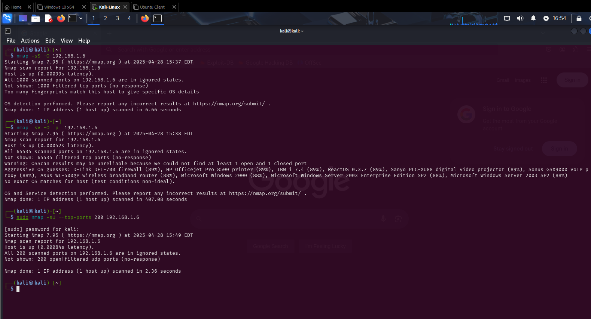

# 🛡️ Penetration Testing Lab: Nmap OS and Service Detection

 
 


## 📖 Scenario

You are a penetration tester using a Kali Linux workstation (`192.168.1.12`).  
Your mission is to scan a Windows 10 target (`192.168.1.6`) to gather:

- 🎯 Operating System (OS) information
- 🔎 Open Ports
- 📡 Protocols in use
- 🛠️ Service version details

---

## 🎯 Objective

- Perform a comprehensive Nmap scan.
- Document findings clearly.
- Capture scan results and screenshots.

---

## 🛠️ Tools Used

- Kali Linux
- Nmap

---
## Lab Folder Structure

```
📁 Penetration-Testing-Lab/
├── 📄 README.md
├── 📁 nmap-scan/
│   ├── 📝 nmap-scan-notes.md
│   ├── 📄 nmap-scan-results.txt
├── 📁 images/
│   ├── 🖼️ nmap_scan.png
```
---

## 📝 Nmap Commands Used

### ✅ Correct Commands:
```bash
nmap -A 192.168.1.6 
nmap -sV -O 192.168.1.6 -p-
```


**Command Breakdown:**
- `-A` : Enables OS detection, version detection, script scanning, and traceroute.
- `-sV` : Detects service versions.
- `-O` : Enables OS detection.
- `-p-` : Scans all 65535 TCP ports.

### ❌ Incorrect Commands:

- `Nmap -sS -O 192.168.1.6`
  - ➡️ Only SYN scan and OS detection, no version detection.

- `192.168.1.10 Nmap -sS -O 192.168.1.6`
  - ➡️ Incorrect syntax — IP should not come first.

- `192.168.1.12 Nmap -p -O`
  - ➡️ Missing correct parameters and target.

---

## 📸 Nmap Scan Screenshot



---

## 🔍 Key Findings

| Category         | Details                        |
|:-----------------|:-------------------------------|
| OS Detection     | Windows 10 Professional         |
| Open Ports       | 80/tcp (HTTP), 135/tcp (RPC), 445/tcp (SMB) |
| Services         | IIS Web Server, Microsoft RPC, SMBv2 |

---

## 🚀 How to Run This Lab

1. Open your Kali Linux machine.
2. Run the Nmap scans:
    ```
    nmap -A 192.168.1.6
    nmap -sV -O 192.168.1.6 -p-
    ```
3. Save results to `nmap-scan/nmap-scan-results.txt`.
4. Take screenshots and save in `screenshots/`.
5. Update findings in `README.md`.

---

## 🧹 Cleanup Tips

- **Delete** scan files if sensitive data is collected.
- **Sanitize** screenshots if uploading to public repositories.

---

## 📜 License

This project is for educational purposes only.  
Use responsibly and within legal boundaries.
